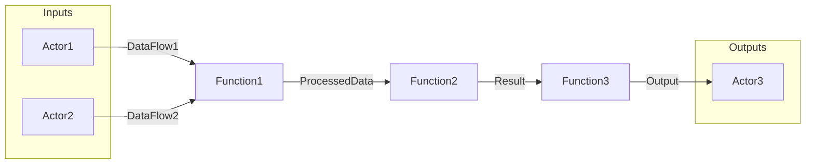

# Plan: Functional Network View Implementation

## Overview
Create a new `functional-network` view that displays all FUNC and ACTOR nodes connected via FLOW nodes using io edges. The view should render as a circuit diagram with:
- No element overlap
- Minimized connection crossings
- Orthogonal (90°) routing

## Understanding from Codebase Analysis

### Current Architecture (from architecture view analysis)
The architecture view in `graph-viewer.ts:816-889` demonstrates the pattern:
1. Collects relevant nodes (FUNC nodes direct children of SYS)
2. Traces FLOW connections: `FUNC -io-> FLOW -io-> FUNC`
3. Renders using Mermaid `graph LR` with text fallback

### functional-flow.json spec shows intended design:
- Algorithm: `orthogonal` (not yet implemented - CR-001)
- Includes: UC, FCHAIN, FUNC, FLOW, ACTOR
- FLOW nodes converted to labeled edges, not separate nodes
- Edge pattern: `FUNC --flowName--> FUNC`

### Key Insight: io Edge Direction
From the functional-flow.json notes:
- `FLOW --io--> FUNC` = input to FUNC
- `FUNC --io--> FLOW` = output from FUNC
- Connection pattern: `Source_FUNC -io-> FLOW -io-> Target_FUNC`

## Implementation Approach

### Option A: Mermaid-based (like architecture view)
**Pros:** Already working pattern, renders to image in iTerm2/Kitty, copy-paste to markdown
**Cons:** Limited control over layout, relies on Mermaid's auto-layout

### Option B: ASCII grid-based (custom orthogonal layout)
**Pros:** Full control over positioning, true circuit diagram aesthetic
**Cons:** Complex to implement, no image export

### **Recommended: Option A (Mermaid) with enhanced Sugiyama-style ordering**

Use Mermaid `flowchart LR` with:
1. Topological sort for left-to-right ordering
2. Subgraphs for ACTOR grouping (inputs left, outputs right)
3. FLOW names as edge labels

## Detailed Design

### 1. View Configuration
```typescript
'functional-network': {
  viewId: 'functional-network',
  name: 'Functional Network View',
  description: 'Circuit diagram of functions connected via data flows',
  layoutConfig: {
    includeNodeTypes: ['FUNC', 'ACTOR', 'FLOW'],
    includeEdgeTypes: ['io'],
    algorithm: 'sugiyama', // conceptually - rendered via Mermaid
    parameters: {
      orientation: 'left-right',
      showFlowLabels: true,
      groupActors: true
    }
  },
  renderConfig: {
    showNodes: ['FUNC', 'ACTOR'],
    hideNodes: ['FLOW'], // FLOW becomes edge labels
    showEdges: ['io']
  }
}
```

### 2. Data Collection Algorithm
```
1. Collect ALL FUNC nodes (not just top-level)
2. Collect ALL ACTOR nodes
3. For each FLOW node:
   - Find source: nodes with `source -io-> FLOW`
   - Find target: nodes with `FLOW -io-> target`
   - Create connection: {source, target, flowName}
4. Classify ACTORs:
   - Input actors: have outgoing io to FLOW (no incoming)
   - Output actors: have incoming io from FLOW (no outgoing)
```

### 3. Rendering (Mermaid flowchart)


### 4. ASCII Text Fallback
```
┌─ FUNCTIONAL NETWORK ──────────────────────────────────┐
│  Functions: 5 | Actors: 3 | Flows: 7                  │
└───────────────────────────────────────────────────────┘

  [ACTOR] User ──DataFlow1──▶ [FUNC] ValidateInput
                              │
                              ▼ ProcessedData
                             [FUNC] ProcessOrder
                              │
                              ▼ OrderResult
  [ACTOR] Admin ◀──Report──── [FUNC] GenerateReport
```

## Implementation Steps

### Step 1: Add ViewType and Config (~15 min)
- Add `'functional-network'` to ViewType union in `view.ts`
- Add config to `DEFAULT_VIEW_CONFIGS`

### Step 2: Implement Renderer (~45 min)
- Add `case 'functional-network':` in switch statement
- Create `renderFunctionalNetworkView()` function
- Create `renderFunctionalNetworkMermaid()` helper (reuse pattern from architecture view)

### Step 3: Create JSON Config (~10 min)
- Create `docs/specs/views/functional-network.json`

### Step 4: Unit Tests (~30 min)
- Test connection tracing: FUNC → FLOW → FUNC
- Test actor classification (input vs output)
- Test Mermaid generation

## Files to Modify

1. `src/shared/types/view.ts` - Add type + config
2. `src/terminal-ui/graph-viewer.ts` - Add render function
3. `docs/specs/views/functional-network.json` - Create config

## Files to Create (Tests)

1. `tests/unit/terminal-ui/functional-network-view.test.ts`

## Estimated Effort
- Implementation: 1.5-2 hours
- Testing: 30 minutes
- **Total: ~2.5 hours**
